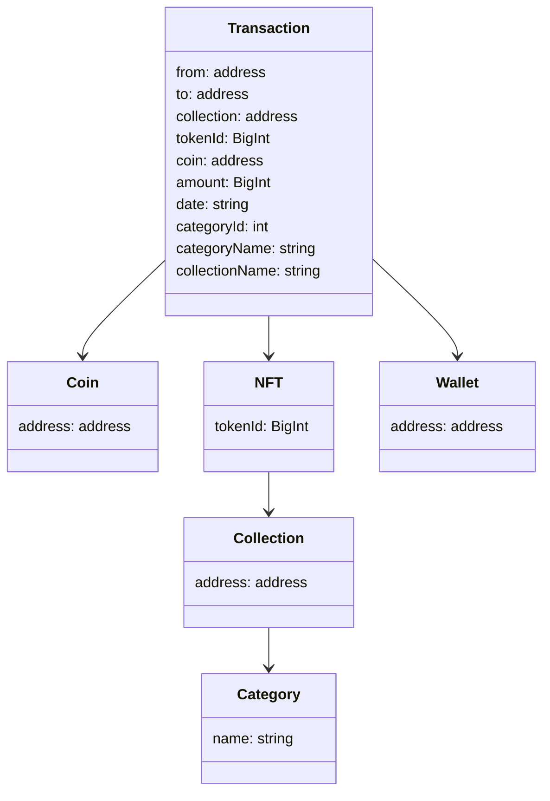

# Class Diagram



1. DataBase
2. Repository
3. Service
4. Controller
5. Frontend - API Client
6. Frontend - Route
7. Frontend - Screen

In the transaction, we include some attributes to prevent the need for joins.

1. Floor price
2. Volume
3. Category
4. Collection

```ts
class Transaction {
    nft: NFT

    getCollectionName() {
        // 1 select na NFT
        // 1 select na collection
        // para retornar o name
        this.nft.collection.name
    }
}

class NFT {
    tokenId: bigint
    collection: Collection
}

class Collection {
    name: string
    address: string
}

{tx.getCollectionName()}
```
